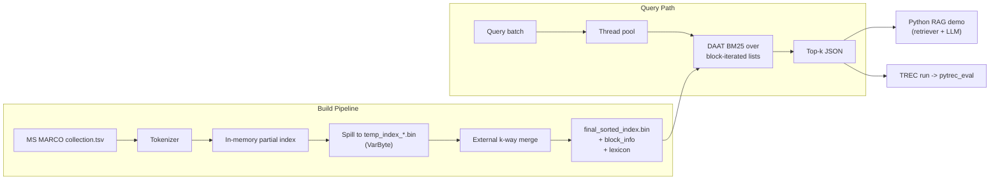

# MS MARCO BM25 Search Engine

> Built an inverted index over 8.8M MS MARCO passages with BM25 ranking and
> parallel query execution. VarByte compression cuts posting-store bytes by
> 69.0%; the compact builder peaks at 164.81 MB RSS on the full corpus, with
> benchmark and TREC-style evaluation artifacts checked into `docs/`.

> Full benchmark tables and charts are in
> [docs/benchmark_results.md](docs/benchmark_results.md). The test suite is
> green under both `IDX_CODEC=VarByte` and `IDX_CODEC=Raw32`.

## At a Glance

| Metric                            | Value           |
| --------------------------------- | --------------- |
| Documents indexed                 | 8,841,823       |
| Index size (VarByte)              | 1.00 GB total   |
| Compression vs. Raw32             | 69.0% posting-store reduction |
| Compact build peak RSS / time     | 164.81 MB / 59.57 s |
| Query latency P50 / P95 / P99     | 2.16 / 6.35 / 8.85 ms at 8 threads |
| QPS @ 8 threads                   | 385.4           |
| MRR@10 (MS MARCO dev)             | 0.1812          |
| nDCG@10 (TREC DL19 / DL20)        | 0.4415 / 0.4976 |
| Recall@1000 (DL19)                | 0.6848          |

Measured locally on Apple M4 Pro / 24 GB RAM / macOS 26.4.1. See
[docs/benchmark_results.md](docs/benchmark_results.md) for full tables and charts.

## Reproduce

```bash
# 1. Fetch MS MARCO Passage v1 + dev / DL19 / DL20 evaluation sets.
bash eval/prepare_msmarco.sh

# 2. Build (Release, VarByte codec).
cmake -B build -DCMAKE_BUILD_TYPE=Release
cmake --build build -j
ctest --test-dir build --output-on-failure

# 3. Build the inverted index.
./build/build_index data/collection.tsv data/index_varbyte/

# 4. Compression ablation (VarByte vs Raw32).
bash scripts/build_two_indexes.sh data/collection.tsv

# 5. Latency benchmark across thread counts.
for n in 1 2 4 8; do
    ./build/bench_latency \
        --index data/index_varbyte/final_sorted_index.bin \
        --lexicon data/index_varbyte/final_sorted_lexicon.txt \
        --blocks data/index_varbyte/final_sorted_block_info.bin \
        --doc-info data/index_varbyte/document_info.txt \
        --queries data/queries.dev.small.tsv --threads $n \
        --csv bench_results/latency_t${n}.csv
done

# 6. Ranking metrics.
bash scripts/eval_all.sh data/index_varbyte

# 7. Builder memory benchmark (Vector vs Compact partial index).
bash bench/run_memory.sh data/collection.tsv

# 8. Try the RAG demo (requires Ollama or OPENAI_API_KEY).
python -m rag_demo.rag_demo --q "what is bm25" \
    --search-cli ./build/search_cli \
    --index data/index_varbyte/final_sorted_index.bin \
    --lexicon data/index_varbyte/final_sorted_lexicon.txt \
    --blocks data/index_varbyte/final_sorted_block_info.bin \
    --doc-info data/index_varbyte/document_info.txt \
    --collection data/collection.tsv
```

## Architecture



## Layout

```
include/    public headers (varbyte / bm25 / codec / thread_pool / ...)
src/        executable sources (build_index / search / search_cli)
bench/      latency, compression, index size, memory benchmarks
eval/       MS MARCO download + TREC run writer + pytrec_eval driver
rag_demo/   Python retriever + LLM demo
tests/      unit tests, run via ctest
docs/       benchmark results, charts
scripts/    helper scripts (build_two_indexes, eval_all, plotters)
```

## Design Highlights

- **VarByte vs Raw32 ablation** - same logical postings, different codec, gives
  a clean apples-to-apples compression number.
- **Memory-bounded index construction** - compact VarByte spill buffers and a
  streaming final merge keep full-corpus build RSS under 165 MB.
- **DAAT BM25 + block-skipping** - block-level metadata supports efficient
  conjunctive queries; MaxScore / WAND remain beyond the current scope.
- **TREC eval pipeline** - produces the same run-file format used by Anserini /
  Pyserini, so results are directly comparable to published baselines.

## Known Limitations

- ASCII-only tokenizer; no stemming; stop-word filtering is query-time only.
- Block-Max WAND, MaxScore early termination, and SIMD-BP128 are outside the
  current scope.
- Single-machine; no sharding / distributed merge.

## License

MIT.
