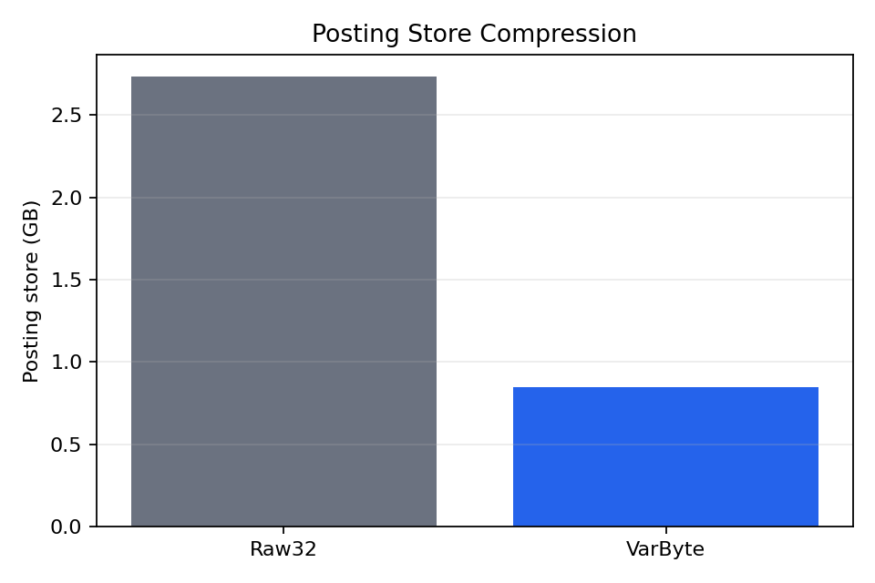
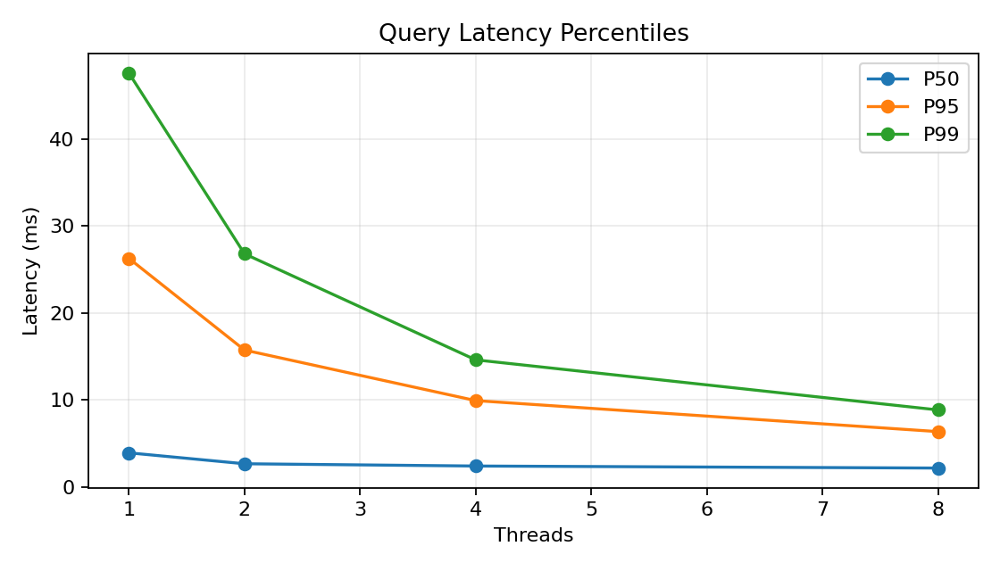
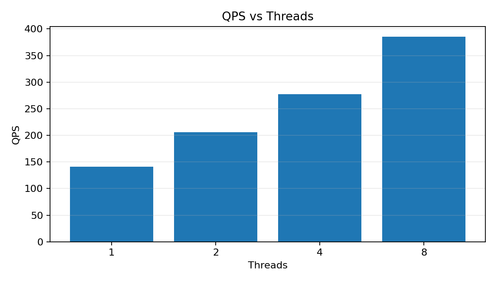

# Benchmark Results

> This report summarizes benchmark and evaluation artifacts generated by
> `bench/`, `scripts/`, and `eval/`.

## Test Environment

- CPU: Apple M4 Pro
- RAM: 24 GB
- OS: macOS 26.4.1
- Compiler: Apple clang 17.0.0
- Filesystem: APFS local volume (`/System/Volumes/Data`)

## Index size (P2 / P6)

| Codec   | Index size | Block info | Lexicon | Total | Ratio vs Raw32 |
| ------- | ---------- | ---------- | ------- | ----- | -------------- |
| Raw32   | 2.65 GB    | 79.50 MB   | 44.79 MB | 2.89 GB | 1.00x       |
| VarByte | 788.12 MB  | 79.50 MB   | 43.50 MB | 1.00 GB | 0.35x       |

Posting-store ratio only: VarByte is `0.310x` Raw32 and saves `69.0%`.

## Index build memory

Measured with `bash bench/run_memory.sh data/collection.tsv` on the full
8,841,823-passage collection. Both modes produced byte-identical
`final_sorted_index.bin`, `final_sorted_block_info.bin`,
`final_sorted_lexicon.txt`, and `document_info.txt`.

| Builder mode | Partial-index storage | Peak RSS | Build time |
| ------------ | --------------------- | -------- | ---------- |
| Vector | decoded `(doc_id, freq)` vectors | 185.08 MB | 204.13 s |
| Compact | compressed VarByte chunks | 164.81 MB | 59.57 s |

Compact mode reduces peak RSS by `10.95%` and build time by `70.82%` versus
the Vector baseline in the current streaming-merge implementation.

## Query latency (P6)

| Threads | QPS | P50 | P95 | P99 |
| ------- | --- | --- | --- | --- |
| 1       | 141.0 | 3.91 ms | 26.27 ms | 47.58 ms |
| 2       | 205.6 | 2.66 ms | 15.73 ms | 26.80 ms |
| 4       | 277.0 | 2.40 ms | 9.92 ms | 14.61 ms |
| 8       | 385.4 | 2.16 ms | 6.35 ms | 8.85 ms |

Measured on all 6,980 MS MARCO dev queries, top-k 10, warmed cache.

## Ranking quality (P7)

| Set  | MRR@10 | nDCG@10 | Recall@1000 |
| ---- | ------ | ------- | ----------- |
| Dev  | 0.1812 | 0.2266 | 0.8373 |
| DL19 | 0.7444 | 0.4415 | 0.6848 |
| DL20 | 0.7952 | 0.4976 | 0.6929 |
